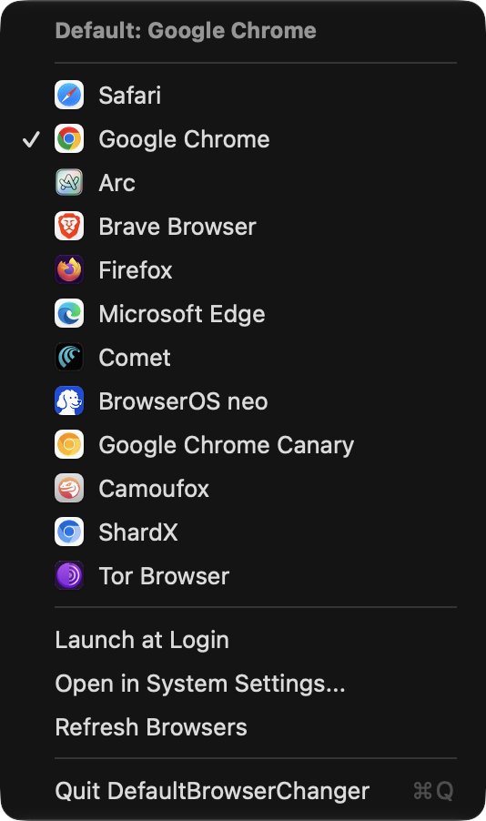

<p align="center">
  
</p>

<h1 align="center">DefaultBrowserChanger</h1>

<p align="center">
  <b>Instant default web browser switching right from your macOS menu bar.</b>
</p>

<p align="center">
  <a href="https://github.com/bsormagec/DefaultBrowserChanger/releases"></a>
  <a href="https://github.com/bsormagec/DefaultBrowserChanger/blob/main/LICENSE"></a>
  
  
  <a href="https://github.com/bsormagec/DefaultBrowserChanger/actions/workflows/ci.yml"></a>
</p>

<br>

<p align="center">
  
</p>

---

## ⚡ The Problem

On modern macOS, switching your default browser requires:
1. Opening **System Settings**
2. Navigating to **Desktop & Dock**
3. Scrolling all the way down to find the **Default web browser** dropdown
4. Selecting the browser and confirming macOS dialogs

If you frequently test web applications across Safari, Chrome, Arc, Brave, Firefox, Edge, or developer browsers, this workflow is slow and disruptive.

## ✨ The Solution

**DefaultBrowserChanger** lives quietly in your menu bar (tray) as an elegant Globe icon:
- 🎯 **One-Click Switch:** Click the Globe, choose any installed browser, done.
- ⌨️ **Global Shortcut (`⌃⌥B`):** Cycle through installed browsers instantly from your keyboard without reaching for the mouse.
- 🎨 **Native Colorful Icons:** Real high-resolution app icons displayed beside each browser.
- ⚡ **Resilient Auto-Confirmation:** Automatically and silently confirms macOS prompts in 0.05s across all macOS languages.
- 🧭 **Welcome Guide:** Modern single-card onboarding wizard on first launch, accessible anytime from the menu bar.
- 🚀 **Launch at Login:** Built-in `SMAppService` toggle so it's always ready when you turn on your Mac.
- 🪶 **Zero Bloat:** Pure native Swift with AppKit and SwiftUI. Consumes under 15MB RAM and 0% CPU.
- 🔒 **100% Private & Offline:** No network access, no telemetry, no tracking.

---

## 💡 Built for Modern Multi-Account & AI Workflows

Today's power users, developers, and AI practitioners rarely live in just one browser:
- 🏢 **Work / Personal Profiles:** Google Chrome for corporate Workspace accounts, Arc or Safari for personal browsing.
- 🤖 **AI Agents & Sandboxes:** Dedicated sessions in BrowserOS neo, Perplexity Comet, or Chrome Canary for AI agents, research, and prompt development.
- 🛡️ **Privacy & Persona Testing:** Brave or Firefox for ad-free environments or secondary testing personas.

### The Problem: The "OAuth & Login Link" Nightmare
When clicking an email verification, a Slack link, or an app's **"Sign in with Google / GitHub"** button, macOS opens it blindly in your default browser. If your default browser isn't signed into the right account, you end up with:
- ❌ Logged into the wrong Google/GitHub account.
- ❌ Failed OAuth redirects and session mix-ups.
- ❌ Annoying manual URL copying and pasting between windows.

### The Fix: Switch in 0.5 Seconds
With **DefaultBrowserChanger**, you click the Globe, select the browser where your active session lives, and click the link. The exact browser you want captures the authentication callback immediately — no profile switching, no URL copying, no friction.

---

## 📥 Installation

### Option 1: Download from GitHub Releases (Recommended)
1. Go to the [Releases](https://github.com/bsormagec/DefaultBrowserChanger/releases) page.
2. Download `DefaultBrowserChanger.zip`.
3. Unzip and drag `DefaultBrowserChanger.app` into your `/Applications` folder.
4. Open the app. The Globe icon will appear in your menu bar!

### Option 2: Build & Install from Source
Ensure you have Xcode Command Line Tools installed (`xcode-select --install`).

```bash
git clone https://github.com/bsormagec/DefaultBrowserChanger.git
cd DefaultBrowserChanger

# Build and install directly to /Applications
./build.sh --install

# Launch the app
open /Applications/DefaultBrowserChanger.app
```

---

## 🖥️ Usage

1. Click the **Globe (🌐)** icon in the top right menu bar.
2. The current default browser is marked with a checkmark (`✓`).
3. Click any browser in the list to switch immediately.
4. You will receive a subtle macOS notification and sound feedback confirming the change.

### Quick Actions Included:
- **Cycle Shortcut (⌃⌥B):** Toggle the global shortcut on or off right from the menu.
- **Launch at Login:** Automatically launches on system startup.
- **Open in System Settings...:** Direct shortcut to Desktop & Dock preferences.
- **Welcome Guide...:** Reopens the onboarding card anytime for permission status and guidance.
- **Refresh Browsers:** Rescans your system for newly installed browsers.
- **Quit:** Clean exit (`⌘Q`).

---

## 🔒 Permissions & Security

macOS considers the default browser preference protected. `DefaultBrowserChanger` uses `LaunchServices` and background Accessibility automation via System Events to confirm the selection automatically in 0.05s.

- Upon first launch, the built-in **Welcome Guide** explains why this permission is needed.
- Click **Grant Permission** to open macOS Accessibility settings (`Privacy & Security > Accessibility`).
- Once granted, switching default browsers is completely silent and instantaneous.
- If permission is not granted, macOS simply displays its standard confirmation dialog on screen for manual confirmation.

---

## 🏗️ Architecture

```
DefaultBrowserChanger/
├── Sources/
│   ├── Models/
│   │   └── BrowserApp.swift          # Browser data model
│   ├── Services/
│   │   ├── BrowserManager.swift      # Discovery, filtering, cycling & LaunchServices switcher
│   │   ├── HotkeyManager.swift       # Carbon global shortcut (⌃⌥B) registration
│   │   └── SystemHelper.swift        # Launch at Login, notifications, sounds & accessibility
│   ├── UI/
│   │   ├── MenuBarController.swift   # NSStatusItem, template icon, & dynamic NSMenu
│   │   ├── OnboardingController.swift# Floating window manager for welcome card
│   │   └── OnboardingView.swift      # Native SwiftUI onboarding wizard card
│   ├── AppDelegate.swift             # App lifecycle, first-launch gating & hotkey setup
│   └── main.swift                    # NSApplication activation policy (.accessory)
├── Resources/
│   ├── Info.plist                    # LSUIElement = true (pure menu bar agent)
│   ├── AppIcon.icns                  # Multi-resolution macOS icon bundle
│   └── AppIcon.png                   # 1024x1024 Retina asset
├── Tests/
│   ├── TestBrowserDetection.swift    # Discovery & default detection tests
│   ├── TestBrowserCycle.swift        # Cycling math & wrap-around tests
│   ├── TestHotkeyManager.swift       # Carbon event registration tests
│   ├── TestOnboardingState.swift     # UserDefaults persistence tests
│   └── TestSystemHelperAccessibility.swift # Accessibility permission API tests
├── build.sh                          # Automated compilation and install script
└── docs/
    └── assets/                       # Screenshots and demo assets
```

---

## 🤝 Contributing

Contributions are welcome! Please read [CONTRIBUTING.md](CONTRIBUTING.md) for details on code style, build instructions, and the pull request process.

## 📄 License

This project is licensed under the MIT License - see the [LICENSE](LICENSE) file for details.
