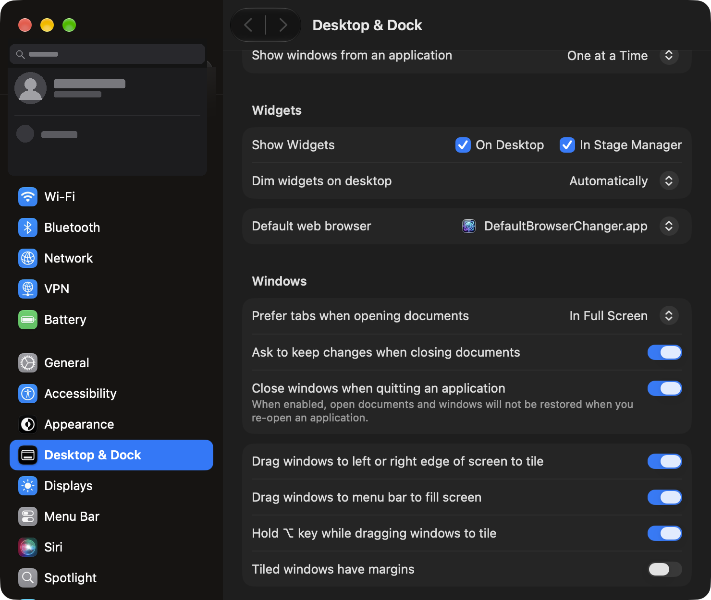

<p align="center">
  
</p>

<h1 align="center">DefaultBrowserChanger</h1>

<p align="center">
  <b>Instant default web browser switching right from your macOS menu bar.</b>
</p>

<p align="center">
  <a href="https://github.com/bsormagec/DefaultBrowserChanger/releases"></a>
  <a href="https://github.com/bsormagec/DefaultBrowserChanger/blob/main/LICENSE"></a>
  
  
  <a href="https://github.com/bsormagec/DefaultBrowserChanger/actions/workflows/ci.yml"></a>
</p>

<br>

<p align="center">
  
</p>

---

## ⚡ The Problem

On modern macOS, switching your default browser requires:
1. Opening **System Settings**
2. Navigating to **Desktop & Dock**
3. Scrolling all the way down to find the **Default web browser** dropdown
4. Selecting the browser and confirming macOS dialogs

If you frequently test web applications across Safari, Chrome, Arc, Brave, Firefox, Edge, or developer browsers, this workflow is slow and disruptive.

## ✨ The Solution

**DefaultBrowserChanger** lives quietly in your menu bar (tray) as an elegant Globe icon:
- 🎯 **One-Click Switch:** Click the Globe, choose any installed browser, done.
- ⌨️ **Global Shortcut (`⌃⌥B`):** Cycle through installed browsers instantly from your keyboard without reaching for the mouse.
- ⚡ **Zero-Prompt Proxy:** 100% native Swift URL routing (0.001s). Zero popups, zero system dialogs, and **zero accessibility permissions**.
- 🎨 **Native Colorful Icons:** Real high-resolution app icons displayed beside each browser.
- 🧭 **Built-in Welcome Guide:** Helpful setup card on first launch, accessible anytime from the menu bar.
- 🛡️ **Single-Instance Guard:** Dual PID and POSIX `flock` file locking ensures only one instance ever runs.
- 🚀 **Launch at Login:** Built-in `SMAppService` toggle so it's always ready when you turn on your Mac.
- 🪶 **Zero Bloat:** Pure native Swift with AppKit and SwiftUI. Consumes under 15MB RAM and 0% CPU.
- 🔒 **100% Private & Offline:** No network access, no telemetry, no tracking.

---

## ⚡ 1-Minute One-Time Setup

To allow DefaultBrowserChanger to route your links instantly to your chosen browser, set it as your default web browser in macOS once:

1. Open **System Settings** → **Desktop & Dock** (or search *"Default web browser"*).
2. In the **Default web browser** dropdown, choose **`DefaultBrowserChanger.app`**.
3. Confirm the one-time macOS prompt (*Use "DefaultBrowserChanger"*).

<p align="center">
  
</p>

> [!TIP]
> For detailed instructions, check the complete [Setup Guide & User Manual](docs/SETUP_GUIDE.md).

---

## 💡 Built for Modern Multi-Account & AI Workflows

Today's power users, developers, and AI practitioners rarely live in just one browser:
- 🏢 **Work / Personal Profiles:** Google Chrome for corporate Workspace accounts, Arc or Safari for personal browsing.
- 🤖 **AI Agents & Sandboxes:** Dedicated sessions in BrowserOS neo, Perplexity Comet, or Chrome Canary for AI agents, research, and prompt development.
- 🛡️ **Privacy & Persona Testing:** Brave or Firefox for ad-free environments or secondary testing personas.

### The Problem: The "OAuth & Login Link" Nightmare
When clicking an email verification, a Slack link, or an app's **"Sign in with Google / GitHub"** button, macOS opens it blindly in your default browser. If your default browser isn't signed into the right account, you end up with:
- ❌ Logged into the wrong Google/GitHub account.
- ❌ Failed OAuth redirects and session mix-ups.
- ❌ Annoying manual URL copying and pasting between windows.

### The Fix: Switch in 0.001 Seconds
With **DefaultBrowserChanger**, press `⌃⌥B` or click the Globe, select the browser where your active session lives, and click the link. The exact browser you want captures the authentication callback immediately — no profile switching, no URL copying, no friction.

---

## 📥 Installation

### Option 1: Download from GitHub Releases (Recommended)
1. Go to the [Releases](https://github.com/bsormagec/DefaultBrowserChanger/releases) page.
2. Download `DefaultBrowserChanger.zip`.
3. Unzip and drag `DefaultBrowserChanger.app` into your `/Applications` folder.
4. Open the app and follow the 1-minute setup above!

### Option 2: Build & Install from Source
Ensure you have Xcode Command Line Tools installed (`xcode-select --install`).

```bash
git clone https://github.com/bsormagec/DefaultBrowserChanger.git
cd DefaultBrowserChanger

# Build and install directly to /Applications
./build.sh --install

# Launch the app
open /Applications/DefaultBrowserChanger.app
```

---

## 🖥️ Usage

1. Click the **Globe (🌐)** icon in the top right menu bar.
2. The current active target browser is marked with a checkmark (`✓`).
3. Click any browser in the list to switch immediately.
4. Or press **`Control + Option + B` (`⌃⌥B`)** anywhere to cycle to the next browser with sound feedback.

### Quick Actions Included:
- **Cycle Shortcut (⌃⌥B):** Toggle the global shortcut on or off right from the menu.
- **Launch at Login:** Automatically launches on system startup.
- **Open in System Settings...:** Direct shortcut to Desktop & Dock preferences.
- **Welcome Guide...:** Reopens the onboarding card anytime for guidance.
- **Refresh Browsers:** Rescans your system for newly installed browsers.
- **Quit:** Clean exit (`⌘Q`).

---

## 🔒 Permissions & Security

**Zero Special Permissions Required!**

Unlike fragile UI automation or Accessibility-dependent solutions, `DefaultBrowserChanger` operates as a native link proxy (similar to Velja or Browserosaurus):
- **No Accessibility Permissions (`AXIsProcessTrusted`):** Never needed.
- **No Screen Recording / Keystroke Logging:** Completely unprivileged.
- **No AppleScript UI clicking:** Built with 100% native Swift APIs (`NSWorkspace.shared.open`).
- **No Network / Telemetry:** Operates entirely offline on your Mac.

---

## 🏗️ Architecture

```
DefaultBrowserChanger/
├── Sources/
│   ├── Models/
│   │   └── BrowserApp.swift          # Browser data model
│   ├── Services/
│   │   ├── BrowserManager.swift      # Discovery, filtering & app detection
│   │   ├── LinkRouter.swift          # Instant (0.001s) URL proxy & target routing
│   │   ├── HotkeyManager.swift       # Carbon global shortcut (⌃⌥B) registration
│   │   └── SystemHelper.swift        # Launch at Login, notifications, sounds & settings
│   ├── UI/
│   │   ├── MenuBarController.swift   # NSStatusItem, template icon, & dynamic NSMenu
│   │   ├── OnboardingController.swift# Floating window manager for welcome card
│   │   └── OnboardingView.swift      # Native SwiftUI onboarding wizard card
│   ├── AppDelegate.swift             # App lifecycle, URL interception & hotkey setup
│   └── main.swift                    # Single-instance locks (PID & flock) & .accessory policy
├── Resources/
│   ├── Info.plist                    # Document & URL scheme declarations (HTML, HTTP, HTTPS)
│   ├── AppIcon.icns                  # Multi-resolution macOS icon bundle
│   └── AppIcon.png                   # 1024x1024 Retina asset
├── Tests/
│   ├── TestBrowserDetection.swift    # Discovery & default detection tests
│   ├── TestBrowserCycle.swift        # Cycling math & wrap-around tests
│   ├── TestHotkeyManager.swift       # Carbon event registration tests
│   ├── TestLinkRouter.swift          # URL routing & target dispatch tests
│   ├── TestSingleInstance.swift      # Dual-lock duplicate prevention tests
│   └── TestOnboardingState.swift     # UserDefaults persistence tests
├── build.sh                          # Automated compilation and install script
└── docs/
    ├── SETUP_GUIDE.md                # Step-by-step user manual
    └── assets/                       # Screenshots and demo assets
```

---

## 🤝 Contributing

Contributions are welcome! Please read [CONTRIBUTING.md](CONTRIBUTING.md) for details on code style, build instructions, and the pull request process.

## 📄 License

This project is licensed under the MIT License - see the [LICENSE](LICENSE) file for details.
