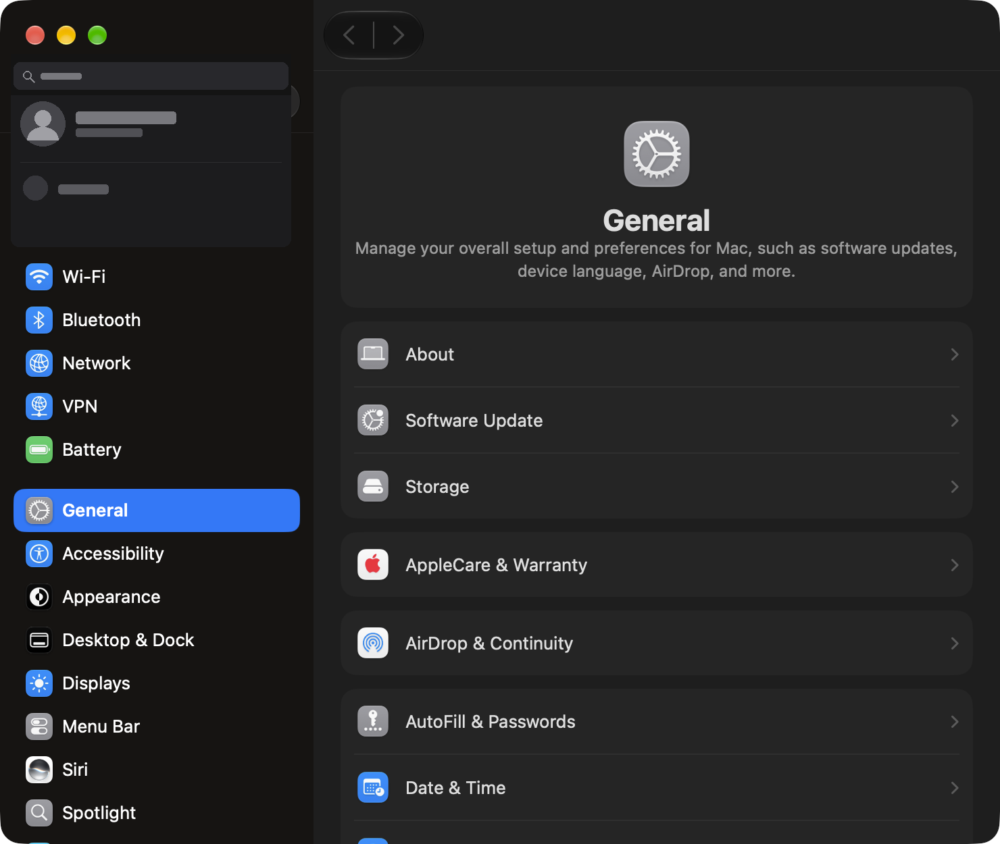
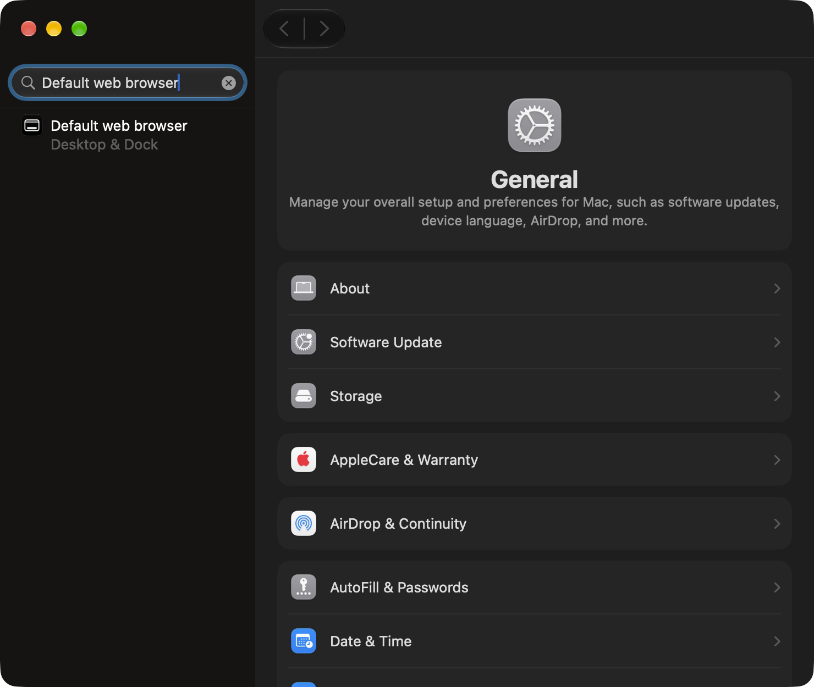
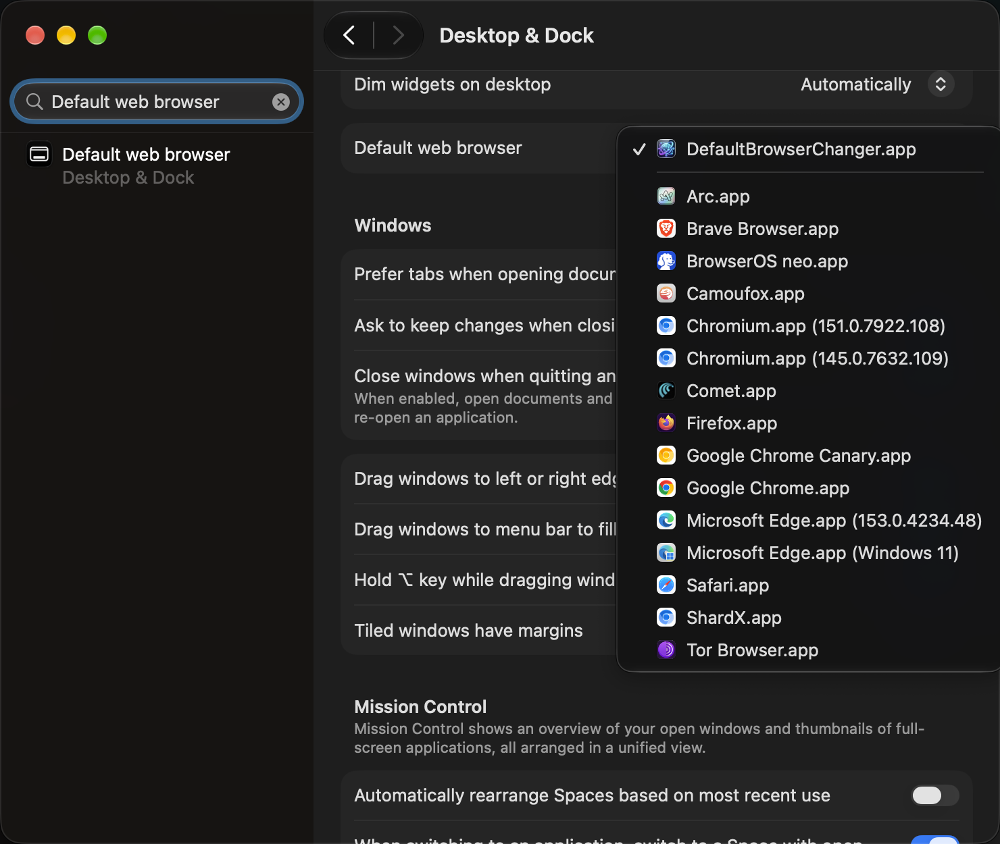

# 🧭 DefaultBrowserChanger — Setup Guide & User Manual

Welcome to **DefaultBrowserChanger**! This guide walks you through the 1-minute, one-time setup to enable instant default browser switching across macOS with **zero permission popups** and **zero system dialogs**.

---

## ⚡ 1-Minute One-Time Setup

To allow DefaultBrowserChanger to intercept and instantly route your web links to your preferred browser, macOS simply needs DefaultBrowserChanger designated as your system's default web browser.

### Step 1: Open System Settings
- Press <kbd>⌘ Command</kbd> + <kbd>Space</kbd>, type **System Settings**, and press <kbd>Return</kbd> (or click  > **System Settings...**).

<p align="center">
  
</p>

### Step 2: Search "Default web browser"
- In the search bar at the top-left of System Settings, type **`Default web browser`**.
- Click the **Default web browser — Desktop & Dock** search result.

<p align="center">
  
</p>

### Step 3: Open the Dropdown & Choose `DefaultBrowserChanger.app`
- In the **Default web browser** setting row, click the dropdown menu showing all installed browsers.
- Select **`DefaultBrowserChanger.app`**.
- If macOS displays a one-time confirmation sheet, click **Use "DefaultBrowserChanger"**.

<p align="center">
  
</p>

✅ **You're all set!** From this moment forward, you will never see another macOS default browser confirmation dialog. Switch browsers anytime from your menu bar or using <kbd>⌃</kbd>+<kbd>⌥</kbd>+<kbd>B</kbd>.

---

## 🚀 How to Use DefaultBrowserChanger

### 1. Menu Bar Dropdown
- Click the **Globe (🌐)** icon in the macOS menu bar at the top-right of your screen.
- A menu will show all your installed browsers (Safari, Chrome, Arc, Brave, Firefox, Edge, etc.) with crisp native icons.
- Click any browser. It instantly becomes your active target browser with sound feedback.

### 2. Global Hotkey (`Control + Option + B` / `⌃⌥B`)
- Press <kbd>⌃ Control</kbd> + <kbd>⌥ Option</kbd> + <kbd>B</kbd> (or your custom shortcut) anywhere on your Mac.
- DefaultBrowserChanger will instantly cycle to your next installed browser with an audio click.
- An on-screen floating HUD pill will appear at the top-center of your screen showing the active browser icon and name!

### 3. Settings Window & Switch List Selection (<kbd>⌘</kbd> + <kbd>,</kbd>)
- Click the Globe menu and choose **Settings...** (or press <kbd>⌘</kbd>+<kbd>,</kbd>).
- **Installed Browsers List:** Use checkboxes to pick exactly which browsers participate in keyboard cycling.
- **Select All:** Quickly enable all detected browsers with one click.
- **Safety Lock:** At least one browser is always kept active to prevent empty cycle states.

### 4. Customizing Your Global Shortcut
- In the **Settings** window under **General**, find **Cycle Shortcut**.
- Click the shortcut badge to enter recording mode (*"Press keys..."*).
- Press any combination on your keyboard (e.g. <kbd>⌥ Option</kbd>+<kbd>Space</kbd> or <kbd>⌘ Command</kbd>+<kbd>⇧ Shift</kbd>+<kbd>B</kbd>).
- The new shortcut is immediately active and registered system-wide.
- Press <kbd>Esc</kbd> anytime to cancel, or click the <kbd>↺</kbd> button to restore the default <kbd>⌃</kbd><kbd>⌥</kbd><kbd>B</kbd>.

### 5. Launch at Login
- Open the Globe menu and ensure **Launch at Login** is checked.
- DefaultBrowserChanger will silently start in your menu bar when you boot your Mac, consuming under 15MB RAM and 0% CPU.

---

## 🧠 Why the Link Interceptor Architecture is Superior

| Feature | Legacy AppleScript Method | DefaultBrowserChanger Proxy |
| :--- | :--- | :--- |
| **Switching Speed** | 0.5 – 1.0 second (UI delay) | **0.001 second (Instant)** |
| **macOS Popups** | Confirmation alert on every switch | **Zero popups (100% silent)** |
| **Accessibility Permissions** | Required (`AXIsProcessTrusted`) | **Zero permissions needed** |
| **macOS Updates** | Fragile (UI button changes break it) | **Bulletproof native Swift (`NSWorkspace`)** |
| **Single-Instance Guard** | None (can spawn duplicates) | **Strict PID & POSIX flock locks** |

---

## ❓ Frequently Asked Questions (FAQ)

### What happens if I quit the app from the menu bar?
If DefaultBrowserChanger is your default browser and is not currently running, clicking any link in Mail, Slack, or Terminal will cause macOS to **automatically launch** DefaultBrowserChanger in the background, route your link instantly to your active browser, and remain ready in the menu bar.

### Does DefaultBrowserChanger inspect or log my URLs?
**No.** DefaultBrowserChanger runs 100% locally and offline. It does not contain any networking code, analytics, or telemetry. It simply receives the URL from macOS and passes it to your selected browser using `NSWorkspace.shared.open`.

### Can I reopen this guide from the app?
Yes! Click the Globe icon in the menu bar and select **Welcome Guide...** at any time.

### What if macOS Gatekeeper shows a warning on first launch?
When you download applications from GitHub or the web using a browser (Safari, Chrome, etc.), macOS automatically applies an extended attribute called `com.apple.quarantine` to the downloaded file. For open-source apps distributed outside the Mac App Store, Gatekeeper prevents direct double-click launching until you explicitly approve the app.

You can resolve this instantly using any of the following methods:

#### Method 1: Remove Quarantine via Terminal (Recommended for power users)
Run this single command in your Terminal:
```bash
xattr -cr /Applications/DefaultBrowserChanger.app
```
- **What this does:**
  - `xattr`: macOS command to manipulate extended file attributes.
  - `-c`: Clears all extended attributes.
  - `-r`: Operates recursively across the entire application bundle.
  - This removes the `com.apple.quarantine` flag completely, allowing the app to launch instantly without any security prompts.

#### Method 2: Right-Click (Control-Click) Open (GUI)
1. Navigate to `/Applications` in Finder.
2. **Right-Click** (or hold <kbd>Control</kbd> and click) `DefaultBrowserChanger.app`.
3. Select **Open** from the menu.
4. In the confirmation dialog, click **Open**.
5. macOS will permanently record your permission, and all future launches will open instantly with a normal click.

#### Method 3: System Settings Security Tab
1. Open **System Settings** → **Privacy & Security**.
2. Scroll down to the **Security** section.
3. You will see: *"DefaultBrowserChanger was blocked from use because it is not from an identified developer."*
4. Click **Open Anyway** and enter your Mac password or Touch ID.
